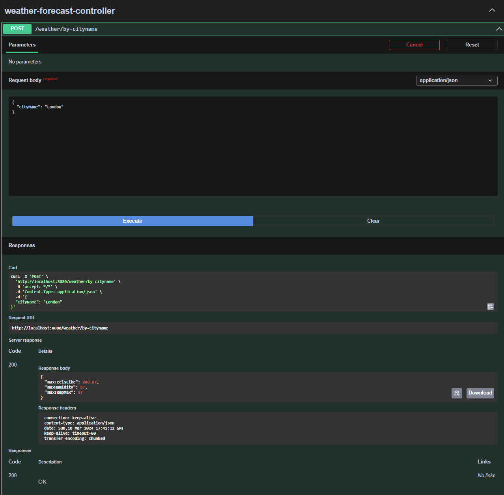

# Weather Forecast Application

Welcome to the Weather Forecast Application! This application provides real-time weather data for various locations.

## Introduction

The Weather Forecast Application is a Java-based web application that allows users to fetch weather data from an external API and display it in a user-friendly format. It utilizes Spring Boot framework for backend development.

## Features

- Fetch weather data by city name
- Display max temperature, humidity, feels like on last 48 hours

## Getting Started

### Prerequisites

Before running the application, ensure you have the following installed:

- Java Development Kit (JDK) 11 or higher
- IDE (e.g., IntelliJ IDEA, Eclipse) for Java development
- Git (optional)

### Installation

1. Clone the repository to your local machine:

   git clone https://github.com/your-username/weather-forecast.git

2. Start Spring Boot REST API bu running belowed command.

    mvn clean install -U
3. Open your browser and navigate to belowed url to access the application.

   http://localhost:8080/swagger-ui/index.html#/weather-forecast-controller

## Acknowledgements

- Thanks to the [OpenWeatherMap](https://openweathermap.org/) for providing weather data API.
- Inspired by [Spring Boot](https://spring.io/projects/spring-boot)